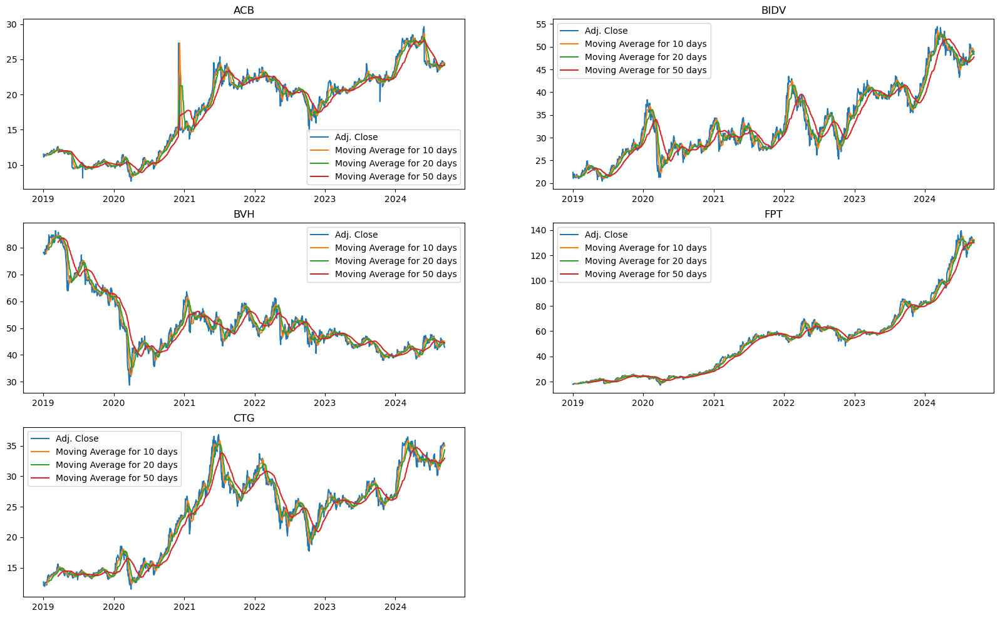
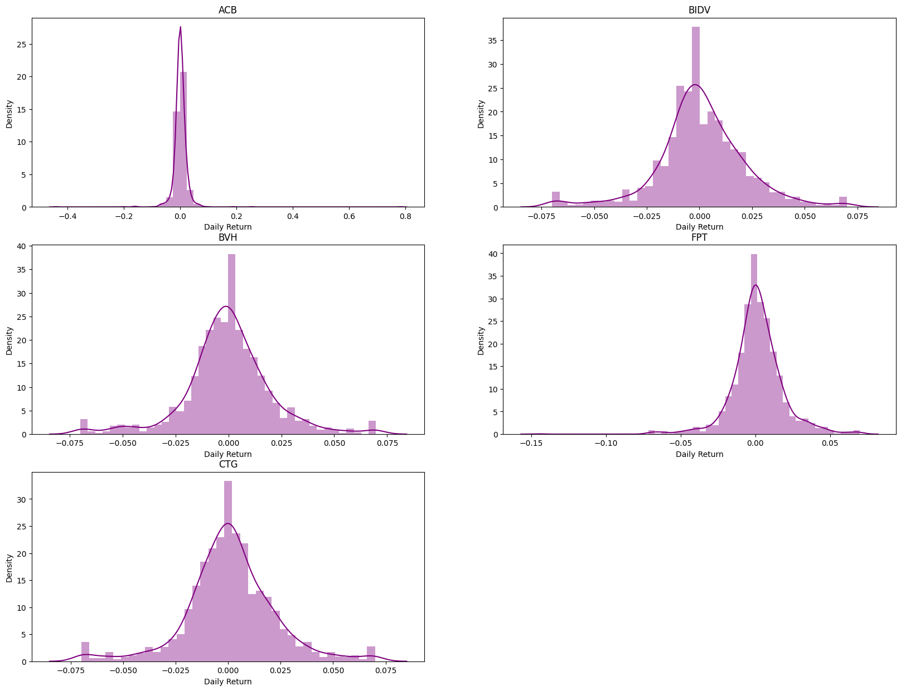
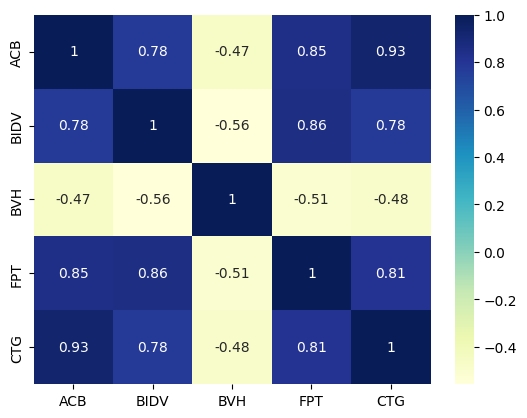
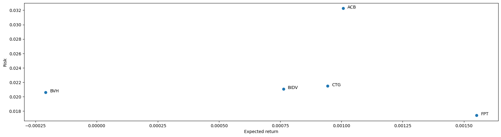
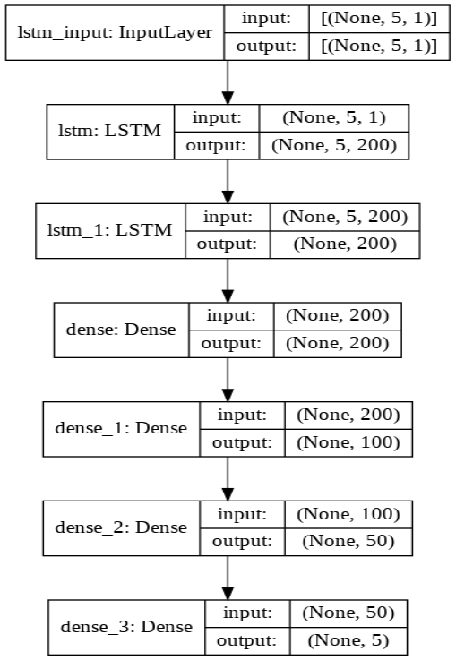

# Stock Price Prediction
 

## Project Overview

Investment firms, hedge funds and even individuals have been using financial models to understand market behaviour better and make profitable investments and trades. A wealth of information is available in the form of historical stock prices and company performance data, suitable for machine learning algorithms to process.

Can we predict stock prices with machine learning? Investors make educated guesses by analyzing data. They will read the news, study the company history, industry trends, and other data points that go into making a prediction. The prevailing theories are that stock prices are totally random and unpredictable, raising the question of why top firms like Morgan Stanley and Citigroup hire quantitative analysts to build predictive models. We have this idea of the trading floor being filled with adrenaline infuse men with loose ties running around yelling something into a phone. However, these days we are more likely to see rows of machine learning experts quietly sitting in front of computer screens. About 70% of all orders on Wall Street are now placed by software. We are now living in the age of algorithms.

This project utilizes the ARIMA model for base predictions and then built a Deep Learning model to improve it further. Stock prices are predicted for Tech Giants like Viettinbank, BIDV, BVH, FPT and ACB.

## Dataset
Webscraped [ https://in.finance.yahoo.com](https://finance.yahoo.com/) using selenium and BeautifulSoup.

## Exploratory Data Analysis

### Closing Price v/s Time
 

We can see from the above graph that Telsa shares have tremendous growth in the 2020-2021 period.
 
If we follow the news, it can be due to

1. Emission Credit Sales
2. Tesla entering the Fast-Growing Compact SUV Market
3. Starting production in China

For the rest of the Companies, we can see that COVID-19 is the primary factor affecting the 2020-2021 period.
 

### Histogram plot of Percentage Daily Return 
 

### Correlation between the stocks daily returns
 

 
From the above plot, we can see that Microsoft and Google had the strongest correlation in stocks daily returns.

### Risk v/s Expected Returns
 

 
From the above graph, we can see that ACB has the highest expected returns and the highest risk factor. FPT has the lowest expected returns and the lowest risk factor.

## Deep Learning Model

### Model
 

  
We train the model using the training dataset records and then use it to forecast the following week’s closing values (i.e., the next five values as a week consists of five working days). The forecasting is done in a multi-step manner with a walk-forward validation mode.    
The details of the design of each layer and the overall architecture of the model are as follows :
 
The input data’s shape to the network’s input layer is (5, 1), indicating that the previous five values (i.e., one week’s data) of the time series are used as the input. Only one attribute of the data (i.e., the closing value) is considered. The input layer passes the data onto the LSTM layer with 200 nodes at the output, with the Leaky ReLU activation function is used in these nodes. The LSTM layer’s output is passed to another LSTM layer with 200 nodes at the output, with the Leaky ReLU as an activation function. This layer’s output is then passed onto a dense layer with 200 nodes at its input and output, with Leaky ReLU activation. This layer’s output is passed onto another dense layer with 200 nodes at its input and 100 nodes with a Leaky ReLU activation function at the output. This layer’s output is passed onto another dense layer with 100 nodes at its input and 50 nodes with a Leaky ReLU activation function at the output. The dense layer is finally connected to the output layer that is also fully-connected. The output layer has 50 nodes at its input and 5 nodes at the output. The 5 nodes at the output produce the forecasted values for the five days of the following week. Again the output layer uses Leaky ReLU as an activation function. The model uses MSE as the loss function and ADAM as the optimizer with a custom learning rate. 

# Model Comparison Results

## Overview

The table below compares the evaluation indicators of two models **ARIMA** and **Deep Learning** based on companies or digital currencies. The indicators included are:

- **RMSE (Root Mean Square Error)**: Measure the mean deviation squared between the actual and predicted values.

- **MAPE (Mean Absolute Percentage Error)**: Measure the percentage of absolute average error.

- **MAE (Mean Absolute Error)**: Measure the average absolute error.

- **SEM (Standard Error of the Mean)**: Standard error of the average.

## Results

| Company | ARIMA Model (RMSE) | ARIMA Model (MAPE) | ARIMA Model (MAE) | ARIMA Model (SEM) | Deep Learning Model (RMSE) | Deep Learning Model (MAPE) | Deep Learning Model (MAE) | Deep Learning Model (SEM) |
| ------- | ------------------ | ------------------ | ----------------- | ----------------- | -------------------------- | -------------------------- | ------------------------- | ------------------------- |
| ACB     | 6.3428             | 6.22%              | 5.5095            | 0.1868            | 1.6783                      | 5.39%                      | 1.3827                    | 0.0699                    |
| BIDV    | 5.1022             | 6.10%              | 4.2803            | 0.2285            | 3.1662                      | 5.46%                      | 2.5834                    | 0.1244                    |
| BVH     | 2.9092             | 2.07%              | 2.9092            | 0.1930            | 1.4457                      | 2.58%                      | 1.0944                    | 0.0863                    |
| CTG     | 3.3969             | 5.07%              | 3.5005            | 0.2166            | 1.6195                      | 4.00%                      | 1.2687                    | 0.0813                    |
| FPT     | 21.0259            | 14.02%             | 15.8303           | 0.8233            | 13.9527                     | 36.71%                     | 11.6538                   | 0.4630                    |

## Observations

- **Deep Learning** is superior to **ARIMA** in most companies (ACB, BIDV, BVH, CTG) with lower RMSE and MAE, demonstrating higher accuracy.

- For **FPT**, the **ARIMA** model has better results with RMSE and lower MAE than Deep Learning, indicating that ARIMA may be more suitable for this company.

- SEM (Standard Fageration) in both models shows the same level of fluctuation, but the Deep Learning model still tends to be more stable.

## References
1. Mehtab, S. (2020, September 20). Stock Price Prediction Using Machine Learning and LSTM-Based Deep Learning Models. ArXiv.Org. https://arxiv.org/abs/2009.10819
2. Chauhan, N. S. (2020, January). Stock Market Forecasting Using Time Series Analysis. KDnuggets. https://www.kdnuggets.com/2020/01/stock-market-forecasting-time-series-analysis.html
3. Dev, U. (2020, June 21). EDA of Stock Market using Time Series - Usharbudha Dev. Medium. https://usharbudha-dev09.medium.com/eda-of-stock-market-using-time-series-9662fd18bfc5
4. Duchi, J., Hazan, E., & Singer, Y. (2011). Adaptive subgradient methods for online learning and stochastic optimization. https://www.jmlr.org/papers/volume12/duchi11a/duchi11a.pdf
5. HUA, Yuxiu, et al. Deep learning with long short-term memory for time series prediction. IEEE Communications Magazine, 2019, 57.6: 114-119. https://arxiv.org/pdf/1810.10161

